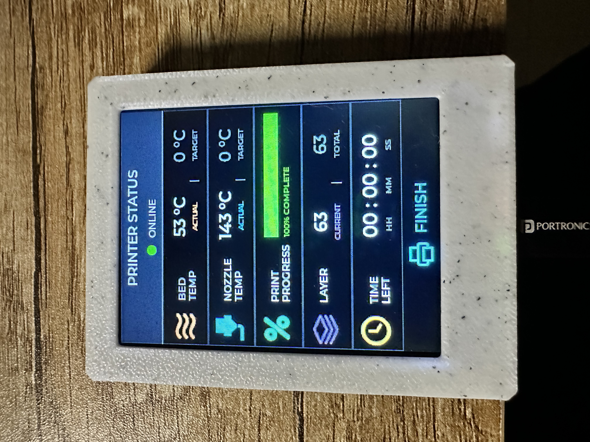
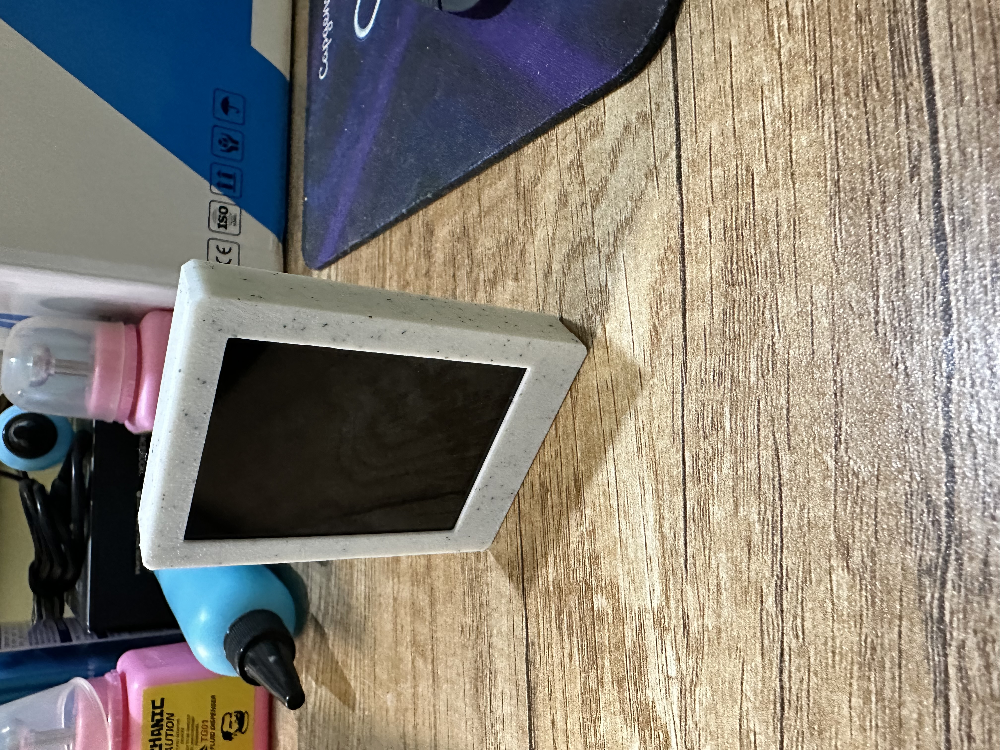
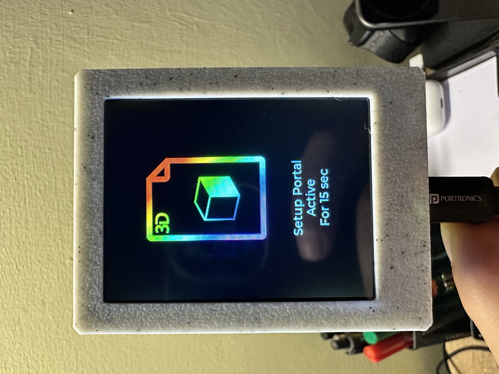
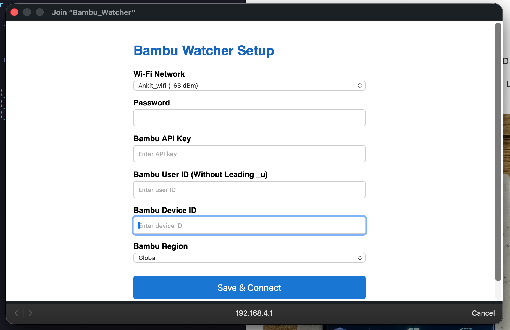

# Bambu Watcher

A small widget to monitor the status of Bambu 3d printer & 3D prints.

Uses waveshare esp32-s3 dev kit, but any similar esp32 with LCD can be used.

<iframe id="js_video_iframe" src="https://jumpshare.com/embed/T5qBrPsEswRuMZ9T3mwk" frameborder="0" webkitallowfullscreen mozallowfullscreen allowfullscreen style="position: absolute; top: 0; left: 0; width: 100%; height: 100%;"></iframe>

