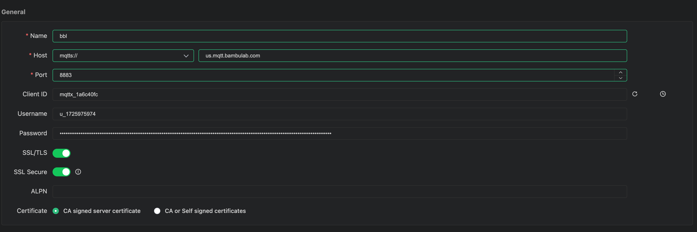
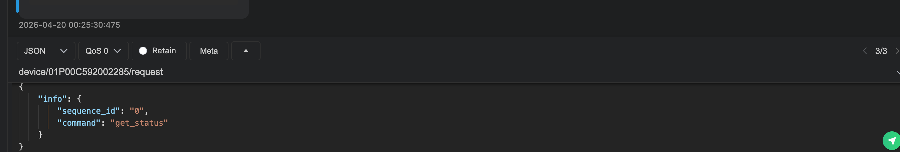

### To get Bambu Api access Token

Reference Links
1. https://github.com/Doridian/OpenBambuAPI/blob/main/mqtt.md

```bash
  python3 login.py --token-file ../../my_babmbu_token 
  Bambu Lab Authentication Tool
  Region: global
  Token file: ../../my_babmbu_token

  Email: ankit.bhatnagarindia@gmail.com
  Password:

  Logging in...
  A verification code has been sent to your email.
  Enter the verification code: 289834
  Login successful!
  Token saved to: ../../my_babmbu_token
  Token: AAA8Raofj8MZaRg6elyD...xDqomViNlLIRWhsOdoz5
```

### To get printer & user profile details
```bash
  python3 ./cli_tools/query.py AABY_woaIZ1Hfvp4eXWQCdCgP5wbbJQ0n_Tgbg9DUIk1yFP41BsKQuFa8CCEv_BP1Or3265xTCpD-_JvmT4stCpZ4wsg3IN3F0eElaGDVZErCpcQF6MQe8d5qj6cMO4WZQPMwlGI92MAObl0 --profile --json
  ================================================================================
  Bambu Lab Printer Information Query
  ================================================================================


  Fetching user profile...
  {
    "uid": 1725975974,
    "uidStr": "1725975974",
    "account": "ankit.bhatnagarindia@gmail.com",
    "name": "ankitmcgill",
    "avatar": "https://public-cdn.bblmw.com/default/avatar.png",
    "fanCount": 0,
    "followCount": 0,
    "identifier": 1,
    "likeCount": 0,
    "collectionCount": 0,
    "downloadCount": 0,
    "productModels": [
      "P1S"
    ],
    "personal": {
      "bio": "",
      "links": [],
      "taskWeightSum": 1496,
      "taskLengthSum": 49712,
      "taskTimeSum": 212497,
      "backgroundUrl": "https://public-cdn.bblmw.com/default/background.png",
      "designsInfo": [],
      "userLevel": {
        "level": 8,
        "gradeType": 1
      }
    },
    "isNSFWShown": 0,
    "myLikeCount": 2,
    "favoritesCount": 5,
    "defaultLicense": "",
    "point": 0,
    "tpModelAccounts": [],
    "bannedPermission": {
      "whole": false,
      "comment": false,
      "upload": false,
      "redeem": false
    },
    "MWCount": {
      "myDesignDownloadCount": 0,
      "myInstanceDownloadCount": 0,
      "designCount": 0,
      "myDesignPrintCount": 0,
      "myInstancePrintCount": 0
    },
    "certificated": false,
    "setting": {
      "isLikeOpen": 0,
      "isFollowOpen": 0,
      "isFanOpen": 0,
      "isFirmwareBetaOpen": false,
      "recommendStatus": 0
    }
}
```

### To monitor printer (Through web based mqtt broker)
```bash
  python3 ./cli_tools/monitor.py u_1725975974 AABY_woaIZ1Hfvp4eXWQCdCgP5wbbJQ0n_Tgbg9DUIk1yFP41BsKQuFa8CCEv_BP1Or3265xTCpD-_JvmT4stCpZ4wsg3IN3F0eElaGDVZErCpcQF6MQe8d5qj6cMO4WZQPMwlGI92MAObl0 01P00C592002285
  ================================================================================
  Bambu Lab Printer Monitor
  ================================================================================
  Device ID: 01P00C592002285
  Broker: us.mqtt.bambulab.com:8883

  Connecting to MQTT...
  ================================================================================

  ================================================================================
  Update #1 - 22:27:39
  ================================================================================

  Device: 01P00C592002285

  Temperatures:
    Nozzle:  N/A -> N/A
    Bed:     32.7C -> N/A
    Chamber: N/A

  Data: 1 fields in message

  ================================================================================
  Update #2 - 22:27:41
  ================================================================================

  Device: 01P00C592002285

  Temperatures:
    Nozzle:  N/A -> N/A
    Bed:     32.7C -> N/A
    Chamber: N/A

  Data: 1 fields in message

  ================================================================================
  Update #3 - 22:27:43
  ================================================================================

  Device: 01P00C592002285

  Temperatures:
    Nozzle:  N/A -> N/A
    Bed:     N/A -> N/A
    Chamber: N/A

  Data: 0 fields in message

  ================================================================================
  Update #4 - 22:27:45
  ================================================================================

  Device: 01P00C592002285

  Temperatures:
    Nozzle:  N/A -> N/A
    Bed:     N/A -> N/A
    Chamber: N/A

  Data: 0 fields in message

  ================================================================================
  Update #5 - 22:27:47
  ================================================================================

  Device: 01P00C592002285

  Temperatures:
    Nozzle:  N/A -> N/A
    Bed:     32.7C -> N/A
    Chamber: N/A

  Data: 1 fields in message
```
### Using MQTTX Cleint

username : bambu user id
password : bambu api access token



## MQTT PROTOCOL

### Connection

```
Broker:   us.mqtt.bambulab.com
Port:     8883 (TLS)
Protocol: MQTT 3.1.1 / 5.0

Authentication:
- Username: <user_id>
- Password: <mqtt_token>
- TLS: Required
```

### Topic Structure

**Subscribe to device updates:**
```
device/<device_id>/report
```

**Publish commands:**
```
device/<device_id>/request
```

### Message Format

**Print Commands:**
```json
{
  "print": {
    "command": "start|pause|stop|resume",
    "sequence_id": "12345",
    "param": {
      "file_url": "https://...",
      "file_name": "model.3mf"
    }
  }
}
```

**Request Full Status (pushall):**
```json
{
  "pushing": {
    "command": "pushall"
  }
}
```

This command requests the printer to send a complete status dump including all sensor data, temperatures, positions, AMS status, and current print job information. The response is received on the `device/<device_id>/report` topic.

### MQTT Status Response Structure

When you subscribe to `device/<device_id>/report` or request full status with `pushall`, the printer sends comprehensive status data.

**Full Status Message Structure:**

The response is a nested JSON with a `print` object containing 60+ fields:

```json
{
  "print": {
    // Temperatures
    "nozzle_temper": 23.625,
    "nozzle_target_temper": 0,
    "bed_temper": 20.71875,
    "bed_target_temper": 0,
    "chamber_temper": 5,
    
    // Print Progress
    "gcode_state": "IDLE|RUNNING|PAUSE|FAILED|FINISH",
    "mc_percent": 45,
    "mc_remaining_time": 3600,
    "layer_num": 125,
    "total_layer_num": 250,
    
    // Print Job Info
    "subtask_name": "model.3mf",
    "project_id": "012345678",
    "profile_id": "012345678",
    "task_id": "012345678",
    "subtask_id": "012345678",
    "gcode_file": "cache/012345678.gcode",
    
    // Fan Speeds (0-15 scale)
    "heatbreak_fan_speed": "0",
    "cooling_fan_speed": "0",
    "big_fan1_speed": "0",
    "big_fan2_speed": "0",
    "fan_gear": 0,
    
    // Speed Settings
    "spd_mag": 100,
    "spd_lvl": 2,
    
    // Print Stage
    "mc_print_stage": "0-20",
    "mc_print_sub_stage": 0,
    "print_type": "idle|cloud_file|local",
    "stg": [],
    "stg_cur": 255,
    
    // Hardware Info
    "nozzle_diameter": "0.4",
    "nozzle_type": "stainless_steel|hardened_steel",
    "lifecycle": "product",
    "wifi_signal": "-45dBm",
    
    // Errors & Status
    "print_error": 0,
    "hms": [
      {
        "attr": 01234567,
        "code": 65543,
        "action": 0,
        "timestamp": 1761352945
      }
    ],
    
    // AMS (Automatic Material System)
    "ams": {
      "ams": [
        {
          "id": "0",
          "humidity": "3",
          "humidity_raw": "28",
          "temp": "25.0",
          "tray": [
            {
              "id": "0",
              "tray_type": "PLA",
              "tray_color": "FF0000FF",
              "nozzle_temp_min": "190",
              "nozzle_temp_max": "230",
              "remain": 750
            }
          ]
        }
      ],
      "ams_exist_bits": "1",
      "tray_exist_bits": "2",
      "tray_now": "255",
      "version": 2
    },
    
    // External Spool (Virtual Tray)
    "vt_tray": {
      "id": "254",
      "tray_type": "PETG",
      "tray_color": "FFFF00FF",
      "remain": 0
    },
    
    // Camera & Lighting
    "ipcam": {
      "ipcam_dev": "1",
      "ipcam_record": "enable",
      "timelapse": "disable",
      "resolution": "1920x1080",
      "tutk_server": "disable"
    },
    "lights_report": [
      {
        "node": "chamber_light",
        "mode": "on|off"
      }
    ],
    
    // Network
    "net": {
      "conf": 0,
      "info": [
        {
          "ip": 3389106368,
          "mask": 01234567
        }
      ]
    },
    
    // Firmware Updates
    "upgrade_state": {
      "status": "IDLE|UPGRADING",
      "progress": "",
      "new_ver_list": [
        {
          "name": "ota",
          "cur_ver": "01.01.01.01",
          "new_ver": "01.01.01.01"
        }
      ]
    },
    
    // Command Info
    "command": "push_status",
    "msg": 0,
    "sequence_id": "1628"
  }
}
```

**Key Field Categories:**

| Category | Fields | Description |
|----------|--------|-------------|
| **Temperatures** | `nozzle_temper`, `bed_temper`, `chamber_temper` | Current temperatures in C |
| **Progress** | `mc_percent`, `layer_num`, `mc_remaining_time` | Print progress info |
| **State** | `gcode_state`, `mc_print_stage`, `print_type` | Current printer state |
| **Speeds** | Fan speeds, `spd_mag`, `spd_lvl` | Fan speeds and print speed |
| **AMS** | `ams`, `vt_tray` | Filament system status |
| **Hardware** | `nozzle_diameter`, `nozzle_type`, `wifi_signal` | Hardware specs |
| **Errors** | `print_error`, `hms` | Error codes and HMS messages |
| **Camera** | `ipcam`, `lights_report` | Camera and lighting status |

**Update Frequency:**
- Status messages typically sent every 0.5-2 seconds
- Full status on connection or when `pushall` requested
- Frequency increases during active printing



#### info.get_version
***
Get current version of printer

Request
```json
{
    "info": {
        "sequence_id": "0",
        "command": "get_version"
    }
}
```
Report
```json
{
    "info": {
        "command": "get_version",
        "module": [
            {
                "hw_ver": "",
                "name": "ota",
                "sn": "",
                "sw_ver": "01.01.01.00"
            },
            {
                "hw_ver": "AP05",
                "name": "rv1126",
                "sn": "[REDACTED]",
                "sw_ver": "00.00.14.74"
            },
            {
                "hw_ver": "TH07",
                "name": "th",
                "sn": "[REDACTED]",
                "sw_ver": "00.00.03.79"
            },
            {
                "hw_ver": "MC07",
                "name": "mc",
                "sn": "[REDACTED]",
                "sw_ver": "00.00.10.48/00.00.10.48"
            },
            {
                "hw_ver": "",
                "name": "xm",
                "sn": "",
                "sw_ver": "00.00.00.00"
            }
        ],
        "sequence_id": "0"
    }
}
```
#### Full Printer Status

**Update Frequency:**
- Status messages typically sent every 0.5-2 seconds
- Full status on connection or when `pushall` requested
- Frequency increases during active printing

Request pushall
topic : device/{device_id}}/request
```json
  {
    "pushing": {
      "command": "pushall"
    }
  }
```

Response
```json
Topic: device/01P00C592002285/reportQoS: 0
{
  "print": {
    "upgrade_state": {
      "sequence_id": 0,
      "progress": "",
      "status": "IDLE", <-------------------- PRINTER STATUS
      "consistency_request": false,
      "dis_state": 1,
      "err_code": 0,
      "force_upgrade": false,
      "message": "0%, 0B/s",
      "module": "",
      "new_version_state": 1,
      "cur_state_code": 0,
      "idx2": 1087835256,
      "new_ver_list": [
        {
          "name": "ota",
          "cur_ver": "01.09.01.00",
          "new_ver": "01.10.00.00",
          "cur_release_type": 3,
          "new_release_type": 3
        },
        {
          "name": "n3f/0",
          "cur_ver": "02.00.19.68",
          "new_ver": "03.00.21.29",
          "cur_release_type": 0,
          "new_release_type": 1
        }
      ]
    },
    "ipcam": {
      "ipcam_dev": "1",
      "ipcam_record": "enable",
      "timelapse": "disable",
      "resolution": "",
      "tutk_server": "disable",
      "mode_bits": 3
    },
    "upload": {
      "status": "idle",
      "progress": 0,
      "message": ""
    },
    "net": {
      "conf": 0,
      "info": [
        {
          "ip": 1782884544,
          "mask": 16777215
        }
      ]
    },
    "nozzle_temper": 37.4375, <-------------------- NOZZLE TEMP
    "nozzle_target_temper": 0, <-------------------- NOZZLE TARGET TEMO
    "bed_temper": 39.96875, <-------------------- BED TEMP
    "bed_target_temper": 40, <-------------------- BED TARGET TEMP
    "chamber_temper": 5,
    "mc_print_stage": "1",
    "heatbreak_fan_speed": "0",
    "cooling_fan_speed": "0",
    "big_fan1_speed": "0",
    "big_fan2_speed": "0",
    "mc_percent": 0, <-------------------- PRINT COMPLETION %
    "mc_remaining_time": 0, <-------------------- PRINT REMAINING TIME
    "ams_status": 0,
    "ams_rfid_status": 0,
    "hw_switch_state": 0,
    "spd_mag": 100,
    "spd_lvl": 2,
    "print_error": 0,
    "lifecycle": "product",
    "wifi_signal": "-29dBm", <-------------------- WIFI SIGNAL STRENGTH
    "gcode_state": "IDLE",
    "gcode_file_prepare_percent": "0",
    "queue_number": 0,
    "queue_total": 0,
    "queue_est": 0,
    "queue_sts": 0,
    "project_id": "0",
    "profile_id": "0",
    "task_id": "0",
    "subtask_id": "0",
    "subtask_name": "",
    "gcode_file": "",
    "stg": [],
    "stg_cur": 0,
    "print_type": "idle",
    "home_flag": 6505752,
    "mc_print_line_number": "0",
    "mc_print_sub_stage": 0,
    "sdcard": true,
    "force_upgrade": false,
    "mess_production_state": "active",
    "layer_num": 0, <-------------------- CURRENT LAYER
    "total_layer_num": 0, <-------------------- TOTAL LAYER
    "s_obj": [],
    "filam_bak": [],
    "fan_gear": 0,
    "nozzle_diameter": "0.4",
    "nozzle_type": "stainless_steel",
    "cali_version": 0,
    "k": "0.0000",
    "flag3": 8863,
    "hms": [],
    "online": {
      "ahb": false,
      "rfid": false,
      "version": 1641237415
    },
    "ams": {
      "ams": [
        {
          "chip_id": "79863b820821b00e48303933fffffff",
          "ams_id": "19C06A562704537",
          "check": 1,
          "id": "0",
          "humidity": "1",
          "humidity_raw": "40", <-------------------- AMS HUMIDITY
          "temp": "35.6", <-------------------- AMS TEMP
          "dry_time": 0,
          "info": "2003",
          "tray": [
            {
              "id": "0",
              "state": 3,
              "remain": -1,
              "k": 0.019999999552965164,
              "n": 1,
              "cali_idx": -1,
              "total_len": 330000,
              "tag_uid": "0000000000000000",
              "tray_id_name": "",
              "tray_info_idx": "GFL99",
              "tray_type": "PLA",
              "tray_sub_brands": "",
              "tray_color": "FFFFFFFF",
              "tray_weight": "0",
              "tray_diameter": "0.00",
              "tray_temp": "0",
              "tray_time": "0",
              "bed_temp_type": "0",
              "bed_temp": "0",
              "nozzle_temp_max": "240",
              "nozzle_temp_min": "190",
              "xcam_info": "000000000000000000000000",
              "tray_uuid": "00000000000000000000000000000000",
              "ctype": 0,
              "cols": [
                "FFFFFFFF"
              ]
            },
            {
              "id": "1",
              "state": 3,
              "remain": -1,
              "k": 0.019999999552965164,
              "n": 1,
              "cali_idx": -1,
              "total_len": 330000,
              "tag_uid": "0000000000000000",
              "tray_id_name": "",
              "tray_info_idx": "GFL99",
              "tray_type": "PLA",
              "tray_sub_brands": "",
              "tray_color": "161616FF",
              "tray_weight": "0",
              "tray_diameter": "0.00",
              "tray_temp": "0",
              "tray_time": "0",
              "bed_temp_type": "0",
              "bed_temp": "0",
              "nozzle_temp_max": "240",
              "nozzle_temp_min": "190",
              "xcam_info": "000000000000000000000000",
              "tray_uuid": "00000000000000000000000000000000",
              "ctype": 0,
              "cols": [
                "161616FF"
              ]
            },
            {
              "id": "2",
              "state": 3,
              "remain": -1,
              "k": 0.019999999552965164,
              "n": 1,
              "cali_idx": -1,
              "total_len": 330000,
              "tag_uid": "0000000000000000",
              "tray_id_name": "",
              "tray_info_idx": "GFL99",
              "tray_type": "PLA",
              "tray_sub_brands": "",
              "tray_color": "76D9F4FF",
              "tray_weight": "0",
              "tray_diameter": "0.00",
              "tray_temp": "0",
              "tray_time": "0",
              "bed_temp_type": "0",
              "bed_temp": "0",
              "nozzle_temp_max": "240",
              "nozzle_temp_min": "190",
              "xcam_info": "000000000000000000000000",
              "tray_uuid": "00000000000000000000000000000000",
              "ctype": 0,
              "cols": [
                "76D9F4FF"
              ]
            },
            {
              "id": "3",
              "state": 3,
              "remain": -1,
              "k": 0.019999999552965164,
              "n": 1,
              "cali_idx": -1,
              "total_len": 330000,
              "tag_uid": "0000000000000000",
              "tray_id_name": "",
              "tray_info_idx": "GFL99",
              "tray_type": "PLA",
              "tray_sub_brands": "",
              "tray_color": "FC66FFFF",
              "tray_weight": "0",
              "tray_diameter": "0.00",
              "tray_temp": "0",
              "tray_time": "0",
              "bed_temp_type": "0",
              "bed_temp": "0",
              "nozzle_temp_max": "240",
              "nozzle_temp_min": "190",
              "xcam_info": "000000000000000000000000",
              "tray_uuid": "00000000000000000000000000000000",
              "ctype": 0,
              "cols": [
                "FC66FFFF"
              ]
            }
          ]
        }
      ],
      "ams_exist_bits": "1",
      "tray_exist_bits": "f",
      "tray_is_bbl_bits": "f",
      "tray_tar": "255",
      "tray_now": "255",
      "tray_pre": "255",
      "tray_read_done_bits": "f",
      "tray_reading_bits": "0",
      "version": 5,
      "insert_flag": true,
      "power_on_flag": false
    },
    "vt_tray": {
      "id": "254",
      "tag_uid": "0000000000000000",
      "tray_id_name": "",
      "tray_info_idx": "",
      "tray_type": "",
      "tray_sub_brands": "",
      "tray_color": "00000000",
      "tray_weight": "0",
      "tray_diameter": "0.00",
      "tray_temp": "0",
      "tray_time": "0",
      "bed_temp_type": "0",
      "bed_temp": "0",
      "nozzle_temp_max": "0",
      "nozzle_temp_min": "0",
      "xcam_info": "000000000000000000000000",
      "tray_uuid": "00000000000000000000000000000000",
      "remain": 0,
      "k": 0.019999999552965164,
      "n": 1,
      "cali_idx": -1
    },
    "lights_report": [
      {
        "node": "chamber_light",
        "mode": "off"
      }
    ],
    "command": "push_status",
    "msg": 0,
    "sequence_id": "3533"
  }
}
```